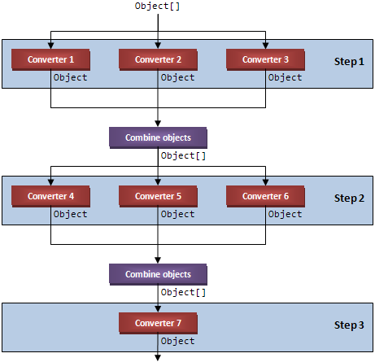

# `MultiConverterGroup`

The `MultiConverterGroup` class has the same goals as the `ConverterGroup` class except that it is an implementation of `IMultiValueConverter` rather than `IValueConverter`. It works with a pipeline of steps (represented by instances of `MultiConverterGroupStep`). Each step can have any number of multi-value converters in it. The output from each step is the combined output from each converter in the step. This output is then fed into the next step. 

If your head hurts from reading that (mine sure does after writing it) then perhaps this diagram will help:



The above example defines three steps in the conversion pipeline. The `MultiConverterGroup` combines objects output from the converters in Step 1 and uses that as the input to Step 2. Similarly, the output from Step 2 is fed into Step 3. The XAML for this example would look like this: 

```XML
<con:MultiConverterGroup> 
    <MultiConverterGroupStep> 
        <Converter1/> 
        <Converter2/> 
        <Converter3/> 
    </MultiConverterGroupStep> 
    <MultiConverterGroupStep> 
        <Converter4/> 
        <Converter5/> 
        <Converter6/> 
    </MultiConverterGroupStep> 
    <MultiConverterGroupStep> 
        <Converter7/> 
    </MultiConverterGroupStep> 
</con:MultiConverterGroup>
```

Note that the last step must always have exactly one converter, which makes sense because at the end of the day the pipeline needs to produce a single value. If you violate this constraint, you’ll get an exception. 

That covers forward conversions, but what about backward conversions? If you examine the diagram, you’ll realize that a backward conversion starts at the bottom and heads toward the top, but could take one of many paths. In theory, if all converters are implemented correctly and they all support backward conversions, then any path from the bottom to the top with the same input would yield the same output. 

In practice, the `MultiConverterGroup` solves this ambiguity by leaning on the left-hand side of the path when converting backwards. In the example, it will pass output from Converter7 into Converter4 and then pass the output from that into Converter1. 
