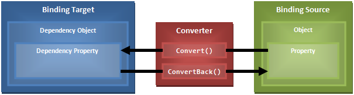

# Overview

WPF’s `Binding` and `MultiBinding` types define a `Converter` property that allows you to provide a converter that will be used during the binding process. If you don’t explicitly specify a value converter, WPF will use its built-in primitive ones behind the scenes (such as `DefaultValueConverter`, `ObjectTargetConverter` and `SystemConvertConverter` – all are `internal` types defined in the `MS.Internal.Data` namespace). 

If you do specify a value converter, WPF will invoke methods on your converter during the data binding process. These methods are: 

* `Convert()`: called to convert a value when propagating it from the binding source to the binding target. 
* `ConvertBack()`: called to convert a value when propagating it from the binding target to the binding source. 

The following diagram depicts this process: 



What I have found whilst working with WPF is that value converters (shown in the middle of the above diagram) are often needed to solve similar problems. This code library seeks to address the most common converter requirements and alleviate the need for a lot of custom converter code in any WPF (or Silverlight) application. 

## Converters 

The following converters are included in this project: 

|Name|Supports Singular Conversions|Supports Multiple Conversions (WPF only)|Supports Forward Conversions|Supports Backward Conversions|Markup Extension Support|
|----|:---------------------------:|:--------------------------------------:|:--------------------------:|:---------------------------:|------------------------|
|[BooleanToVisibilityConverter](boolean-to-visibility-converter.md)|Yes|No|Yes|Yes|WPF, SL5|
|[CaseConverter](case-converter.md)|Yes|No|Yes|Yes|WPF, SL5|
|[ConverterGroup](converter-group.md)|Yes|No|Yes<sup>1</sup>|Yes<sup>2</sup>|None|
|[DateTimeConverter](date-time-converter.md)|Yes|No|Yes|Yes|WPF, SL5|
|[ExpressionConverter](expression-converter.md)|Yes|Yes|Yes|No|WPF, SL5|
|[FormatConverter](format-converter.md)|Yes|Yes|Yes|Yes<sup>3</sup>|WPF, SL5|
|[MapConverter](map-converter.md)|Yes|No|Yes|Yes|None|
|[MultiConverterGroup](multi-converter-group.md)|No|Yes|Yes<sup>4</sup>|Yes<sup>5</sup>|None|
|[TypeConverter](type-converter.md)|Yes|No|Yes|Yes|WPF|

<sup>1</sup>Assuming all child converters support forward conversions.

<sup>2</sup>Assuming all child converters support backward conversions.

<sup>3</sup>Only for singular conversions.

<sup>4</sup>Assuming all child converters support forward conversions.

<sup>5</sup>Assuming all child converters support backward conversions.

## Using the Converters

The links in the above table provide a useful overview of each converter. Please note that the API documentation for each converter provides further examples and detail. In order to use the converters in your application, you must: 

1. Add a reference to the *Kent.Boogaart.Converters.dll* assembly. 
2. Declare an XML->CLR namespace mapping to `http://schemas.kent.boogaart.com/converters`. 

All the examples in this section assume a declaration such as:

```XML
<Window xmlns:con="http://schemas.kent.boogaart.com/converters">
```